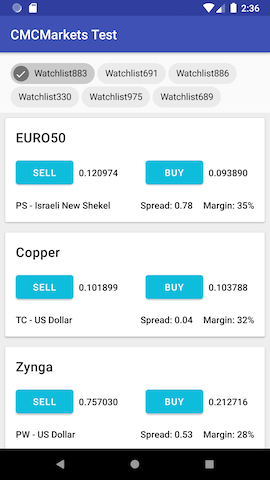

# CMC Markets

## Introduction
This is an exercise to understand how you solve a day to day problem.

## Problem
It is required to build a list of products, featuring their names, characteristics and prices, as well as BUY/SELL buttons.
An example is shown below:

#### Requirements
- The information should be displayed as it comes from the API responses, formatted to fit the view as in the example image.
- An important requirement is that no product cells should be displayed before their names are known.
- The app should deal with expected errors gracefully. In the case of error fetching product data, the appropriate error screen should be displayed. In case of the prices, they should be replaced by a dash (-).
- The BUY/SELL buttons do not have to work.
- Beware we pay for prices and thus it is important that we only stream prices when the user is looking at them.

## Instructions
- It is expected that the exercise should take no more than a few hours.
- Do read the Java docs provided in the api module. There are mock implementations in the internal package, wire them to the APIs and do not modify them.
- You can choose the architecture or patterns that suit you. It is not required that the code is perfect, but it should have a good structure.
- Feel free to alter the xml layouts and view, as well as any dependencies in the gradle file.
- The layouts are already developed and the APIs have a mock implementation that you can tie to the interfaces.
- If you cannot finish, please append a document explaining what you would have done.

## Restrictions
- We require the solution to make extensive use of the RxJava framework.

## How to test network conditions
You can tweak the FailureRates file for session loss. Network availability is monitored for disconnection.

## Next steps
If you are accepted, we will call you for a face to face interview.

